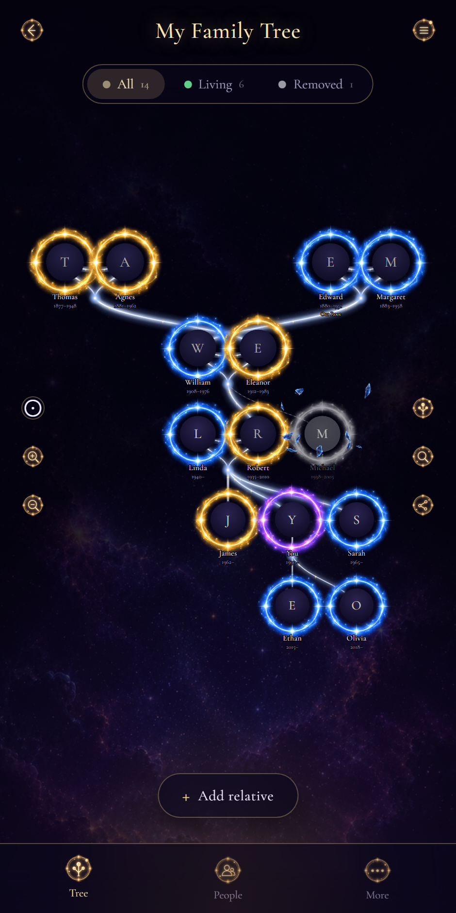
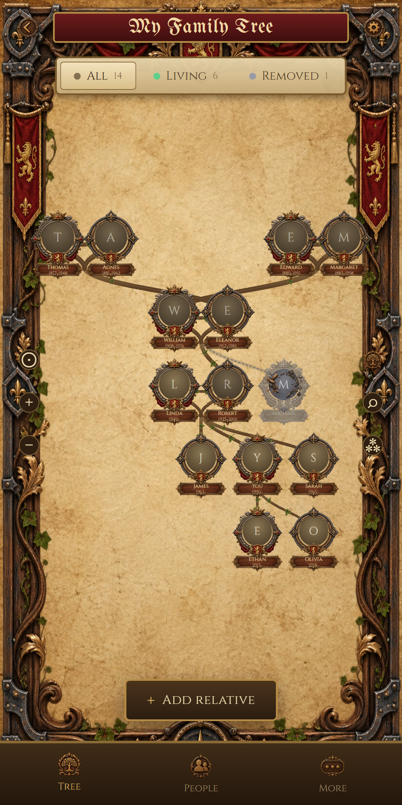
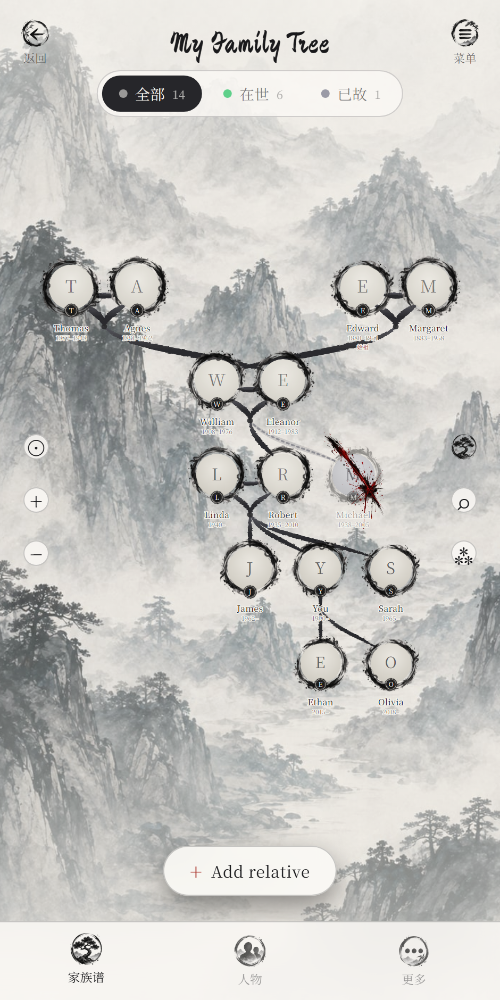

# 🌳 Family Tree Maker

A family tree that renders as an actual tree — a trunk, curved organic branches that
taper as they reach outward, and circular portrait nodes in themed frames — instead of
the usual boxes-and-lines org chart.

Three swappable visual themes (**Celestial**, **Medieval**, **Wuxia / Murim**) change how
the same family is drawn without touching the underlying data.



| Celestial | Medieval | Wuxia / Murim |
| --- | --- | --- |
|  |  |  |

---

## Running it

```bash
npm install
npm run dev
```

The app works with no backend at all: without Firebase configured it saves trees to
browser-local storage, which is enough to explore every feature. To sync trees across
devices, add Firebase config (below).

```bash
npm run build      # typecheck + production build
npm run preview    # serve the build on :4173
```

---

## How the tree is drawn

The interesting part is `src/lib/` — everything else is UI around it.

### Generations are derived, never stored

`layout.ts` computes each person's generation by relaxing
`depth(child) = max(depth(parents)) + 1` to a fixpoint, with spouses and siblings pulled
onto a shared row. Add a grandparent last and everyone still lands on the right row.

### Layout is layered, not a plain `d3.tree()`

People are grouped into **unions** — a couple, or a single unpartnered person, plus the
children hanging beneath them. This is what gives the mockups their shape: partners sit
side by side and their children fan out from one junction below the pair.

A strict tree cannot express this graph, because a married couple descends from *two*
families at once and a tree can only hang them off one — which is what strands one set
of grandparents off to the side. So `d3-hierarchy` is used for what it is good at here:
walking the spanning tree to get a sensible left-to-right starting order. The horizontal
packing is then refined by repeated **barycentre sweeps** — each union slides toward the
average position of the families above and the children below it, and overlaps within a
row get pushed apart. A couple settles between both sets of their parents, and parents
settle centred over their children.

### Branches are filled outlines, not strokes

`branchPath.ts` samples a cubic bezier between two points, offsets the samples along
their normals by half the local width, and closes the outline back on itself. That is
what lets a single branch be thick where it leaves the trunk and hairline-thin where it
meets a leaf node — a stroked path cannot vary its width.

Width falls off geometrically per generation (`widthForDepth`), so a run of generations
reads as one continuously tapering limb. Two width profiles are supported: `taper`
(thick to thin, for Celestial and Medieval) and `brush` (fine at both ends, full-bodied
through the middle, like a loaded ink brush lifted off the paper — for Wuxia).

### Animations

- **Growth** — the tapered body is revealed through an SVG `mask` whose centre line is
  stroked with an animated `stroke-dashoffset`, so the limb visibly extends from its
  origin. The node then pops in at the end. The camera pans to follow the new relative,
  so the growth is actually seen even on a tree wider than the screen.
- **Soft removal** — each theme plugs in its own effect (see below). These are persistent
  *states*, not one-shot animations: the effect stays drawn while the relationship is
  removed, and only *plays* on the transition.
- **Hard prune** — node and branch crumble away, then the records are deleted.

All of it honours `prefers-reduced-motion`.

---

## Removing a relative is two-stage

Removal never silently deletes anyone.

1. **Remove this relative** — every relationship touching them flips to `status: 'removed'`.
   Their branch turns grey and dotted, and their node plays the active theme's removal
   effect. Nothing is deleted, and **Regrow this branch** puts it all back.
2. **Prune permanently…** — only offered on an already-removed person, behind a separate
   confirm. The branch crumbles away, and the relationship records plus the person (and
   anyone this orphaned) are deleted for good.

A person is treated as removed once *every* relationship touching them is removed, which
is why someone with no relationships at all is never shown as removed.

`deathDate` is a different concept entirely: it gives a subtle "passed" wash over the
portrait, never a removal effect.

---

## Themes

`src/themes/themes.ts` is one config object per theme — palette, fonts, background plate,
branch profile, frame artwork, removal effect, and UI chrome (filter pills, bottom-nav
labels). The renderer underneath is identical for all three. Switching theme swaps only
the render config; the family data is untouched.

| | Celestial | Medieval | Wuxia / Murim |
| --- | --- | --- | --- |
| Background | nebula / starfield | aged parchment + carved border | ink-wash mountains |
| Branches | thin glowing lines, star-points | carved wood, ivy sprites | ink brush strokes |
| Node frame | glowing ring, colour-coded by lineage | 3 ornate metal castings, alternating | brush-stroke ensō, rotated per person |
| Label | name + dates | brass name plaque | name + dates, surname seal badge |
| Removal | particle shatter | crack + shatter | red ink slash with drip |

Celestial rings are assigned by **which side of the family** a person descends from
(`lib/lineage.ts`) — blue for one ancestral line, gold for the other, with purple held
back for the current user so it is never handed out as a lineage colour.

### Where the art comes from

All theme art is the supplied set in `Things/` at the repo root. Nothing is downloaded at
build or run time, and nothing is fetched from a CDN.

Those files are loose sprite sheets — several sprites per image, laid out irregularly and
ringed with soft glow haze — so `scripts/extract-assets.mjs` slices them into individual
assets under `src/assets/themes/<theme>/`:

```bash
npm run assets      # re-run after changing anything in Things/
```

It floors near-zero alpha so haze does not leave a grey box behind, finds each sprite as
a connected component of the alpha mask (dilated first, so a sprite's detached specks and
splatter stay with it), and masks out neighbouring sprites so a square crop does not drag
in a slice of the frame next to it. For the circular portrait frames it also locates the
**transparent aperture** in the middle and records its radius in `manifest.json`; the
renderer scales each frame by `radius / apertureRatio`, which is what lets frames with
very different bezel widths drop into the same slot.

A couple of sheets need fixed-grid slicing rather than component detection — the three
Celestial glow rings overlap haloes, and the Wuxia ensō icons are drawn broken-open with
loose splatter. Those cases are declared per sheet in the script.

**Two gaps to be aware of**, both flagged rather than substituted:

- The Medieval and Wuxia icon sheets have no magnifier, share or zoom glyph. Those three
  controls fall back to a typographic character in those themes. The reference mockups
  only show that side rail on the Celestial screen, so this is not visible in the
  intended designs.
- The sheets cover tree chrome only, so modal actions (close, edit, delete, copy) use
  text labels rather than invented icons.

Fonts are the free Google Fonts named in the asset brief: UnifrakturMaguntia (Medieval
title), Ma Shan Zheng + Noto Serif SC (Wuxia), Cormorant Garamond / Cinzel elsewhere.

---

## Privacy and sharing

Each tree gets a short id (`abcd-efgh`) and an **edit passcode**.

- Anyone with the link can **view** the tree.
- Adding, editing or removing anything requires the passcode, entered once per device
  under Settings → Edit access.
- The passcode is never stored or transmitted in plaintext. Only a salted SHA-256 digest
  is written to Firestore, and the client compares digests before it will issue a write
  (`src/lib/passcode.ts`).

### This is lightweight protection, not authentication

Be clear-eyed about what this buys you: it stops a forwarded link from being casually
edited by whoever receives it. It is **not** bank-grade security. Because there is no
signed-in identity, Firestore rules have no server-side principal to check — anyone who
can read the tree document can read the hash, and a determined person could write to the
tree directly. The rules therefore enforce what they *can* (a tree must be created with a
hash, that hash can never be rewritten so a tree cannot be taken over, and nothing can be
written into a tree that does not exist) and the passcode check itself lives on the
client.

If the family wants real privacy, move to **Firebase Auth** and gate the rules on
`request.auth.uid` with an explicit member list per tree.

Portraits are stored inline on the person record as a data URL, centre-cropped and
re-encoded to 320px so documents stay well inside Firestore's 1 MB limit. That keeps
provisioning to Firestore alone — no Firebase Storage bucket needed.

---

## Firestore

```
trees/{treeId}
  name, passcodeHash, themeId, rootPersonId, createdAt

trees/{treeId}/people/{personId}
  name, birthDate, deathDate, photoUrl, notes, frameVariant, isSelf, createdAt

trees/{treeId}/relationships/{relationshipId}
  fromPersonId, toPersonId, type, status, createdAt
```

`type` is one of `parent | spouse | sibling` — "child" is just the inverse of `parent`,
stored one direction and derived the other. `status` is `active | removed`.

### Provisioning

```bash
firebase login
firebase init firestore
firebase deploy --only firestore:rules
firebase apps:create web family-tree-web
firebase apps:sdkconfig web          # prints the values below
```

Copy `.env.example` to `.env.local` and fill in:

```
VITE_FIREBASE_API_KEY=
VITE_FIREBASE_AUTH_DOMAIN=
VITE_FIREBASE_PROJECT_ID=
VITE_FIREBASE_STORAGE_BUCKET=
VITE_FIREBASE_MESSAGING_SENDER_ID=
VITE_FIREBASE_APP_ID=
```

Leave them unset and the app transparently falls back to browser-local storage
(`src/lib/storage.ts` picks the backend; Settings → Storage tells you which is live).

Live updates use `onSnapshot`, so everyone holding the link sees changes as they happen.

---

## Deploying

```bash
npm run build
netlify deploy --prod --dir=dist
```

Set the Firebase config as Netlify environment variables so the deployed build talks to
Firestore:

```bash
netlify env:set VITE_FIREBASE_API_KEY "..."
netlify env:set VITE_FIREBASE_AUTH_DOMAIN "..."
netlify env:set VITE_FIREBASE_PROJECT_ID "..."
netlify env:set VITE_FIREBASE_STORAGE_BUCKET "..."
netlify env:set VITE_FIREBASE_MESSAGING_SENDER_ID "..."
netlify env:set VITE_FIREBASE_APP_ID "..."
```

`netlify.toml` already sets the build command, the SPA fallback redirect, and immutable
caching for hashed assets.

---

## Checking it still works

```bash
npm run preview                                   # in one terminal
node scripts/smoke.mjs http://localhost:4173 shots
```

Drives a real browser through the flows that matter: create a tree, grow a branch,
soft-remove, confirm nothing was deleted, reload to prove persistence, confirm a reloaded
visitor is read-only, unlock with the passcode, restore, and hard-prune.

`node scripts/screenshot.mjs http://localhost:4173 screenshots` refreshes the images at
the top of this file.

---

## Layout of the source

```
src/
  components/
    TreeCanvas.tsx      SVG root, d3-zoom pan/zoom, filters, camera controls
    Branch.tsx          one tapered bezier branch, themed, active or withered
    PersonNode.tsx      circular portrait + themed frame + label
    frames.tsx          the three frame styles, sized off measured apertures
    RemovalEffect.tsx   shatter / crack-shatter / ink-slash
    TreeDefs.tsx        per-theme SVG filters and gradients
    TreeScreen.tsx      chrome: top bar, filter pills, side rails, bottom nav
    Landing.tsx  AddRelativeModal.tsx  PersonCard.tsx  SettingsPanel.tsx
    ThemeBackdrop.tsx  Modal.tsx  icons.tsx
  themes/
    themes.ts           one config per theme
    assets.ts           resolves the sliced art + aperture metadata
  lib/
    layout.ts           generations, unions, layered barycentre packing
    branchPath.ts       tapered bezier outline generator
    lineage.ts          which ancestral line each person belongs to
    storage.ts          Firestore / localStorage repositories
    firebase.ts  passcode.ts  photo.ts  seed.ts  id.ts
  state/
    useTreeStore.ts     zustand store + all add/remove/prune flows
scripts/
  extract-assets.mjs    slices Things/ into src/assets/themes/
  smoke.mjs             end-to-end browser checks
  screenshot.mjs        regenerates the README images
```
